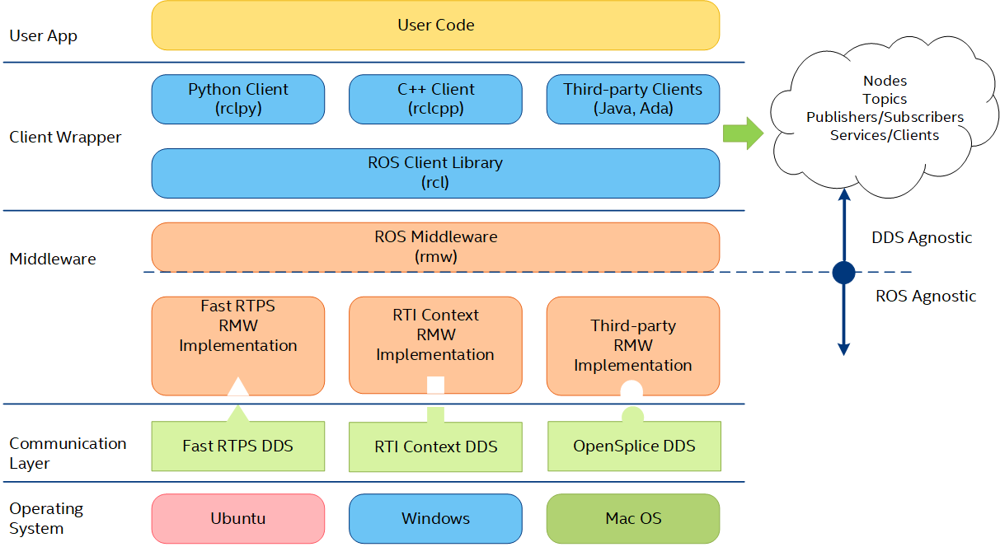

<div>
    <h1>Introduction to ROS 2</h1>
    <p class="font-500">Robot Operating System 2</p>
</div>

<div class="absolute bottom-15">
    Marina Nelson
</div>

---

# Overview

<div>
    <ul>
        <li><strong>ROS 2</strong> is an open-source framework containing libraries and tools to develop robotics systems.
            <ul>
                <li>Provides a modular structure for writing robotics software.</li>
                <li>Used in research, education, and industry.</li>
            </ul>
        </li>
    </ul>
</div>

---
layout: default
---



---
layout: section
---

# ROS 2 Terminology

---

# Nodes

<div>
    <ul>
        <li>Nodes are <strong>instances of executables</strong> that perform specific computational tasks.
        </li>
        <li>Nodes communicate/interact with each other via:
            <ul>
                <li><strong>Topics</strong> (publish/subscribe)</li>
                <li><strong>Services</strong> (request/response)</li>
                <li><strong>Actions</strong> (request/response with feedback)</li>
            </ul>
        </li>
        <!-- <li>Nodes are written in Python3 or C++ using the ROS 2 client libraries:
            <ul>
                <li>rclpy</li>
                <li>rclcpp</li>
            </ul>
        </li> -->
        <li><strong>Examples:</strong>
            <ul>
                <li>Depth Control</li>
                <li>BlueROV2 Camera Interface</li>
            </ul>
        </li>
    </ul>
</div>

---
layout: image
image: "./resources/ROS2_Nodes.gif"
---

---

# Topics & Messages

<div>
    <ul>
        <li>Topics are named buses that nodes use to communicate messages via:
            <ul>
                <li><strong>Publishers</strong> (talkers)</li>
                <li><strong>Subscribers</strong> (listeners)</li>
            </ul>
        </li>
        <li>
            <ul>Messages are the information communicated between nodes via topics.
                <li>Message types are the structure of that information.</li>
            </ul>
        </li>
        <li><strong>Example:</strong>
            <ul>
                <li>The BlueROV2 camera interface node publishes <strong>sensor_msgs/msg/Image</strong> messages on the topic named <strong>/bluerov2/camera</strong>.</li>
            </ul>
        </li>
    </ul>
</div>

---

# Topics & Messages (cont.)

<div>
    <ul>
        <li>Message types are structured using fields that contain:
            <ul>
                <li><strong>Field Type</strong> (primitive data types, other message types, arrays)</li>
                <li>Field Name</li>
            </ul>
        </li>
        <li><strong>Example:</strong></li>
    </ul>
</div>

```c {all|1-2|4|5-9|10|all}
# sensor_msgs/msg/Image message
# file: sensor_msgs/msg/Image.msg

std_msgs/Header header
uint32 height
uint32 width
string encoding
uint8 is_bigendian
uint32 step
uint8[] data
```

---
layout: image
image: "./resources/ROS2_Topic_Nx_Publisher_Nx_Subscriber.gif"
---

---

<h1>Services</h1>

<div>
    <ul>
        <li>Services allow nodes to communicate using a request/response mechanism.
            <ul>
                <li><strong>Client</strong> (sends a request to the a server)</li>
                <li><strong>Server</strong> (handles requests from clients and sends responses)</li>
            </ul>
        </li>
        <li>Service types are structured like message types, but specify the structure of the request and response.</li>
        <li><strong>Example:</strong>
            <ul>
                <li>To arm or disarm the BlueROV2, a client sends a request to a service named <strong>/bluerov2/arming</strong>, and receives a response whether the request was successful.</li>
            </ul>
        </li>
    </ul>
</div>

```c {all|1-2|4|6-7|all}
# std_srvs/srv/SetBool service
# file: std_srvs/srv/SetBool.srv

bool data
---
bool success
string message
```

---
layout: image
image: "./resources/ROS2_Service.gif"
---

---

<h1>Parameters</h1>

<div>
    <ul>
        <li>Parameters are values used to configure nodes that are specified at startup and runtime.
            <ul>
                <li>"Node Settings"</li>
            </ul>
        </li>
        <li><strong>Examples:</strong>
            <ul>
                <li>An IP address or port that is used to connect to a BlueROV2.</li>
                <li>PID gains that are used to control the motion of the BlueROV2.</li>
            </ul>
        </li>
    </ul>
</div>

---

# Workspace & Packages

<div>
    <ul>
        <li>Workspaces are directories where users store and build their ROS 2 code.
            <ul>
                <li>Packages must be built in the workspace using <strong>colcon build</strong> before use.</li>
            </ul>
        </li>
        <li>Workspaces contain four subdirectories:
            <ul>
                <li><strong>src/</strong> (contains user-written packages and code)</li>
                <li>build/ (contains intermediate files)</li>
                <li>install/ (contains final files and executables)</li>
                <li>log/ (contains colcon build output)</li>
            </ul>
        </li>
        <li>Packages are organization units for your code.
            <ul>
                <li>Each package should contain specific pieces of a robotic system.</li>
            </ul>
        </li>
    </ul>
</div>

---
layout: section
---

# ROS 2 Environment Setup

<div class="absolute bottom-15">
    Follow Along
</div>