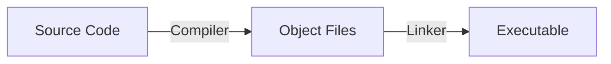

# Introduction to C++

## BWSI AUVC 2023

<div class="absolute bottom-10">
  <span class="font-700">
    Dr. Mohamed Saad Ibn Seddik 👨‍✈️ - © 2023
  </span>
</div>

---

# What is C++?

- C++ is a general-purpose programming language created by Bjarne Stroustrup as an extension of the C programming language, or "C with Classes".
- The language has expanded significantly over time, and modern C++ now has object-oriented, generic, and functional features in addition to facilities for low-level memory manipulation.
- It is almost always implemented as a compiled language, and many vendors provide C++ compilers, including the Free Software Foundation, LLVM, Microsoft, Intel, Oracle, and IBM, so it is available on many platforms.
- C++ was designed with a bias toward system programming and embedded, resource-constrained software and large systems, with performance, efficiency, and flexibility of use as its design highlights.

---

# Why C++?

- C++ is a powerful general-purpose programming language. It can be used to develop operating systems, browsers, games, and so on.
- C++ supports different ways of programming like procedural, object-oriented, functional, and so on. This makes C++ powerful as well as flexible.
- C++ is a portable language. This means that C++ programs once written can be run on different platforms without any or minimal changes.
- C++ provides a rich library that contains built-in functions. This makes programming easier and reduces the coding length.

---

# Basic Syntax

- C++ is case-sensitive. So, uppercase and lowercase letters are treated differently.
- All statements and expressions must end with a semicolon (;).
- Whitespace is used to improve readability. Extra spaces are ignored by the compiler.
- Comments can be used to explain C++ code. There are two ways to add comments to a C++ program:
  - Single-line comments start with two forward slashes `//`.
  - Multi-line comments start with `/*` and end with `*/`.

```cpp {all|1-2|4-5|7|9-11|all}
double x = 1.0;
double X = 2.0;

do_some_stuff();
  this_is_fine();

// This is a single-line comment

/*
This is a multi-line comment
*/
```

---

# Variables

- A variable is a name given to a memory location. It is the basic unit of storage in a program.
- The value stored in a variable can be changed during program execution.
- A variable is only a name given to a memory location, all the operations done on the variable effects that memory location.
- In C++, all the variables must be declared before use.

<br>

```cpp {all|1-3|5-12|all}
double g = 9.81;
int x = 1;
std::string name = "Dr. Saad";

std::cout << "The value of g is " << g << std::endl;
// The value of g is 9.81

std::cout << "The value of x is " << x << std::endl;
// The value of x is 1

std::cout << "The value of name is " << name << std::endl;
// The value of name is Dr. Saad
```


---

# Data Types

- Data types specify how we enter data into our programs and what type of data we enter.
- C++ provides various data types that can be used in your programs.

<br>

| Data Type | Description |
| --------- | ----------- |
| `int` | Used to store an integer value. |
| `float` | Used to store decimal numbers with single precision. |
| `double` | Used to store decimal numbers with double precision. |
| `char` | Used to store a single character. |
| `bool` | Used to store either `true` or `false`. |


---

# Data Types of the standard C++ library

- The standard C++ library provides additional data types that can be used in your programs.

<br>

| Data Type | Description |
| --------- | ----------- |
| `string` | Used to store a sequence of characters. |
| `array` | Used to store fixed-size sequential collection of elements of the same type. |
| `vector` | Used to store variable-size sequential collection of elements of the same type. |
| `set` | Used to store a collection of elements of the same type. |
| `map` | Used to store a collection of key-value pairs. |

---

# Data Types of the standard C++ library (cont.)

- To use the data types of the standard C++ library, you need to include the appropriate header file.
- For example, to use the `string` data type, you need to include the `<string>` header file.

<br>

```cpp {all|1,7,11|2,6|3,10|all}
#include <iostream>
#include <string>
#include <vector>

int main() {
  std::string name = "Dr. Saad";
  std::cout << "The value of name is " << name << std::endl;
  // The value of name is Dr. Saad

  std::vector<int> v = {1, 2, 3};
  std::cout << "The value of v[0] is " << v[0] << std::endl;

  return 0;
}
```

---

# Data Types of the standard C++ library (cont.)

- `vector`, `set`, and `map` are called containers because they can be used to store multiple values.
- `vector`, `set`, and `map` are called templates because they can store values of any type.

```cpp {all|3,8,9|4,11|5,13|all}
#include <iostream>
#include <string>
#include <vector>
#include <set>
#include <map>

int main() {
  std::vector<int> v = {1, 2, 3};
  std::cout << "The value of v[0] is " << v[0] << std::endl;

  std::set<int> s = {1, 2, 3};

  std::map<std::string, int> m = {{"a", 1}, {"b", 2}, {"c", 3}};

  return 0;
}
```

---

# Data Types of the standard C++ library (cont.)

## `vector`
- A `vector` is a sequence container that encapsulates dynamic size arrays.
- The storage of the `vector` is handled automatically, being expanded and contracted as needed.
- `vector` elements are placed in contiguous storage so that they can be accessed and traversed using iterators.

<br>

```cpp {all|1-7|9|10|all}
std::vector<int> v_i = {1, 2, 3};

std::vector<double> v_d = {1.0, 2.0, 3.0};

std::vector<std::string> v_s = {"a", "b", "c"};

std::vector<std::vector<int>> v_v_i = {{1, 2}, {3, 4}};

v_i.push_back(4); // {1, 2, 3, 4}
v_i.size(); // 4
v_i.pop_back(); // {1, 2, 3}
v_i.size(); // 3
v_i[0]; // 1
```

---

# Data Types of the standard C++ library (cont.)

## `set`
- A `set` is an associative container that contains a sorted set of unique objects of type `Key`.
- Sorting is done using the key comparison function `Compare`.
- Search, removal, and insertion operations have logarithmic complexity.

<br>

```cpp {all|1-2|4-5|7-8|10-12|14|all}
std::set<int> s_i = {1, 2, 3};
std::set<std::string> s_s = {"a", "b", "c"};

s_i.insert(4); // {1, 2, 3, 4}
s_i.size(); // 4

s_i.erase(4); // {1, 2, 3}
s_i.size(); // 3

s_i.insert(1); // {1, 2, 3}
s_i.size(); // 3
s_i.count(1); // 1

s_i.count(4); // 0
```


---

# Data Types of the standard C++ library (cont.)

## `map`

- A `map` is an associative container that contains a sorted set of unique key-value pairs.
- Search, removal, and insertion operations have logarithmic complexity.
- Maps are usually implemented as red-black trees.

<br>

```cpp {all|1-2|3|5-6|8-9|11-13|all}
std::map<std::string, int> m = {{"a", 1}, {"b", 2}, {"c", 3}};
m["a"]; // 1
m["d"]; // Error!

m.insert({"d", 4}); // {{"a", 1}, {"b", 2}, {"c", 3}, {"d", 4}}
m.size(); // 4

m.erase("d"); // {{"a", 1}, {"b", 2}, {"c", 3}}
m.size(); // 3

m.insert({"a", 4}); // {{"a", 4}, {"b", 2}, {"c", 3}}
m.size(); // 3
m["a"]; // 4
```

---

# Functions

- A function is a block of code that performs a specific task.
- A function can be called from anywhere in the program.
- A function can be called multiple times.
- A function can be called recursively.

<br>

```cpp
return_type function_name(parameter_list) {
  // function body
}
```

Here:
- The `return_type` is the data type of the value returned by the function.
- The `function_name` is the name of the function.
- The `parameter_list` is the list of parameters passed to the function.

---

# Functions (cont.)

For example:

```cpp
int sum(int a, int b) {
  return a + b;
}

int main() {
  int x = 1;
  int y = 2;
  int z = sum(x, y);
  std::cout << "The value of z is " << z << std::endl;
  // The value of z is 3

  return 0;
}
```

---

# Classes

- A class is a user-defined data type.
- A class can contain data members (variables) and member functions (functions).
- `public` members can be accessed from anywhere in the program.
- `private` members can only be accessed from within the class.
- `protected` members can only be accessed from within the class and its subclasses.

<br>

```cpp {all|2-4|5-7|8-10|all}
class class_name {
public:
  // data members
  // member functions
protected:
  // data members
  // member functions
private:
  // data members
  // member functions
};
```

---

# Classes (cont.)

Example:

```cpp {all|1-8|11|12-15|all}
class Person {
public:
  std::string name;
  int age;
  void print() {
    std::cout << "My name is " << name << " and I am " << age << " years old." << std::endl;
  }
};

int main() {
  Person p;
  p.name = "John";
  p.age = 20;
  p.print();
  // My name is John and I am 20 years old.

  return 0;
}
```

---

# Classes (cont.)

Example:

```cpp {all|2-4|5-12,16,17|6-9,16|10-12,17-18|all}
class Person {
private:
  std::string name;
  int age;
public:
  Person(std::string name, int age) {
    this->name = name;
    this->age = age;
  }
  void print() {
    std::cout << "My name is " << name << " and I am " << age << " years old." << std::endl;
  }
};

int main() {
  Person p("John", 20);
  p.print();
  // My name is John and I am 20 years old.

  return 0;
}
```

---

# Conditional Statements

- Conditional statements are used to perform different actions based on different conditions.
- The `if` statement executes a block of code if a specified condition is `true`.
- The `if-else` statement executes a block of code if a specified condition is `true`. Otherwise, it executes another block of code.
- The `if-else if-else` statement executes a block of code if a specified condition is `true`. Otherwise, it checks another condition. If the condition is `true`, it executes another block of code. Otherwise, it executes another block of code.

```cpp
if (condition) {
  // code
}

if (condition1) {
  // code
} else if (condition2) {
  // code
} else {
  // code
}
```

---

# Loops

- Loops are used to execute a block of code repeatedly.
- The `while` loop executes a block of code as long as a specified condition is `true`.
- The `do-while` loop executes a block of code at least once and then repeatedly executes it as long as a specified condition is `true`.
- The `for` loop executes a block of code a specified number of times.

```cpp
while (condition) {
  // code
}

do {
  // code
} while (condition);

for (initialization; condition; increment) {
  // code
}
```

---

# Loops (cont.)

Example:

```cpp {all|2-6|8-11|13-15|all}
int main() {
  int i = 0;
  while (i < 5) {
    std::cout << i << std::endl;
    i++;
  }

  do {
    std::cout << i << std::endl;
    i++;
  } while (i < 5);

  for (int j = 0; j < 5; j++) {
    std::cout << j << std::endl;
  }

  return 0;
}
```

---

# Pointers

- A pointer is a variable that stores the address of another variable.
- A pointer can be dereferenced to access the value of the variable it points to.
- A pointer can be used to access the variable it points to.
- A pointer can be used to pass a variable by reference to a function.

<br>
```cpp
type *pointer_name = &variable_name;
*pointer_name = value;
```

Here:
- The `type` is the data type of the variable.
- The `pointer_name` is the name of the pointer.
- The `variable_name` is the name of the variable.

---

# Pointers (cont.)

Example:

```cpp {all|1-3|4-6|7-9|all}
int main() {
  int x = 1;
  int *p = &x;

  std::cout << "The value of x is " << x << std::endl;
  // The value of x is 1

  std::cout << "The value of p is " << p << std::endl;
  // The value of p is 0x7ffeeb7b4a3c

  std::cout << "The value of *p is " << *p << std::endl;
  // The value of *p is 1

  return 0;
}
```

---

# Pointers (cont.)

- You can access members of a class using a pointer to an object of the class.

<br>

```cpp
class_name *pointer_name = &object_name;
pointer_name->member_name = value;
```

Here:
- The `class_name` is the name of the class.
- The `pointer_name` is the name of the pointer.
- The `object_name` is the name of the object.
- The `member_name` is the name of the member.

---

# Pointers (cont.)

Example:

```cpp {all|1-5|8-10|12|12-14|8-17|all}
class Person {
public:
  std::string name;
  int age;
};

int main() {
  Person p;
  p.name = "John";
  p.age = 20;

  Person *pointer = &p;
  pointer->name = "Mary";
  pointer->age = 30;

  std::cout << "My name is " << p.name << " and I am " << p.age << " years old." << std::endl;
  // My name is Mary and I am 30 years old.

  return 0;
}
```

---

# References

- A reference is an alias for another variable.
- A reference can be used to access the variable it refers to.
- A reference can be used to pass a variable by reference to a function.

<br>
```cpp
type &reference_name = variable_name;
```

Here:
- The `type` is the data type of the variable.
- The `reference_name` is the name of the reference.
- The `variable_name` is the name of the variable.

---

# References (cont.)

Example:

```cpp {2-3|5-9|11|11-14|all}
int main() {
  int x = 1;
  int &r = x;

  std::cout << "The value of x is " << x << std::endl;
  // The value of x is 1

  std::cout << "The value of r is " << r << std::endl;
  // The value of r is 1

  r = 2;

  std::cout << "The value of x is " << x << std::endl;
  // The value of x is 2

  return 0;
}
```

---

# References (cont.)

- You can access members of a class using a reference to an object of the class.

<br>

```cpp
class_name &reference_name = object_name;
reference_name.member_name = value;
```

Here:
- The `class_name` is the name of the class.
- The `reference_name` is the name of the reference.
- The `object_name` is the name of the object.
- The `member_name` is the name of the member.

---

# References (cont.)

Example:

```cpp {all|1-5|8-10|12|12-14|8-17|all}
class Person {
public:
  std::string name;
  int age;
};

int main() {
  Person p;
  p.name = "John";
  p.age = 20;

  Person &reference = p;
  reference.name = "Mary";
  reference.age = 30;

  std::cout << "My name is " << p.name << " and I am " << p.age << " years old." << std::endl;
  // My name is Mary and I am 30 years old.

  return 0;
}
```

---

# Good Practices

- Use `const` whenever possible: `const` ensures that a variable cannot be modified.
  This is specially useful when passing variables to functions.
- Use references instead of pointers whenever possible: references are safer than pointers.

```cpp
void function(const type &reference_name);
```

Here:
- The `type` is the data type of the variable.
- The `reference_name` is the name of the reference.


---

# Build Systems

- A build system is a tool that automates the process of building an executable from source code.
- A build system can be used to compile, link, and run a program.


## CMake

- CMake is a cross-platform build system generator.
- CMake can generate build files for different build systems.
- CMake can be used to build C++ programs.

---

# Build Systems (cont.)


## Compiler

- A compiler is a program that translates source code into machine code.
- C++ source code is compiled into object files.
  Object files contain machine code and information about the symbols in the source code.

## Linker

- A linker is a program that links object files into an executable.
- The linker resolves references to symbols in the object files.
- The linker generates an executable file.

---


# Libraries

- A library is a collection of functions and/or classes.
- A library can be static or dynamic:
  - A static library is linked to the executable at compile time.
  - A dynamic library is linked to the executable at run time.

<br>

- The linker can be used to link libraries to an executable.

---
layout: quote
---

# Let's get coding!
# 👩‍💻🧑‍💻👨‍💻