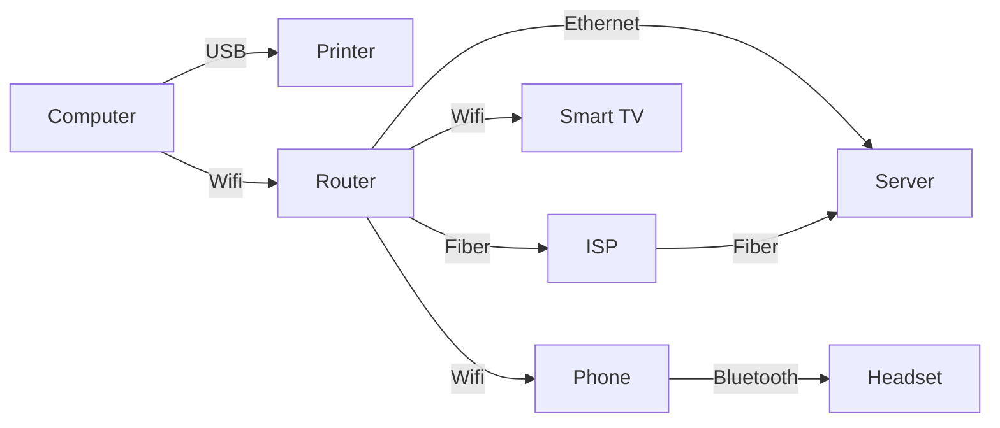
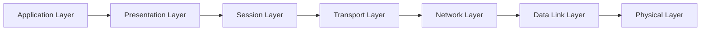
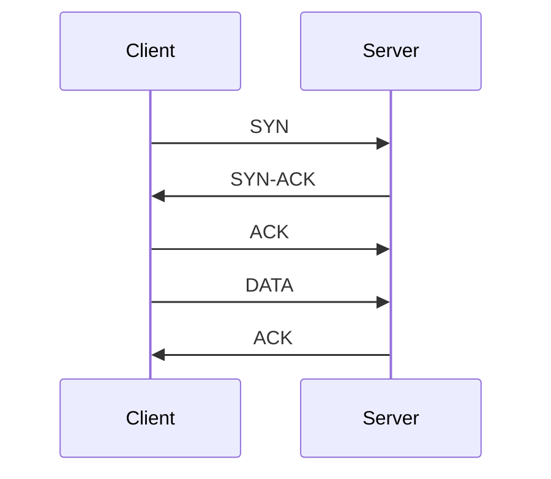
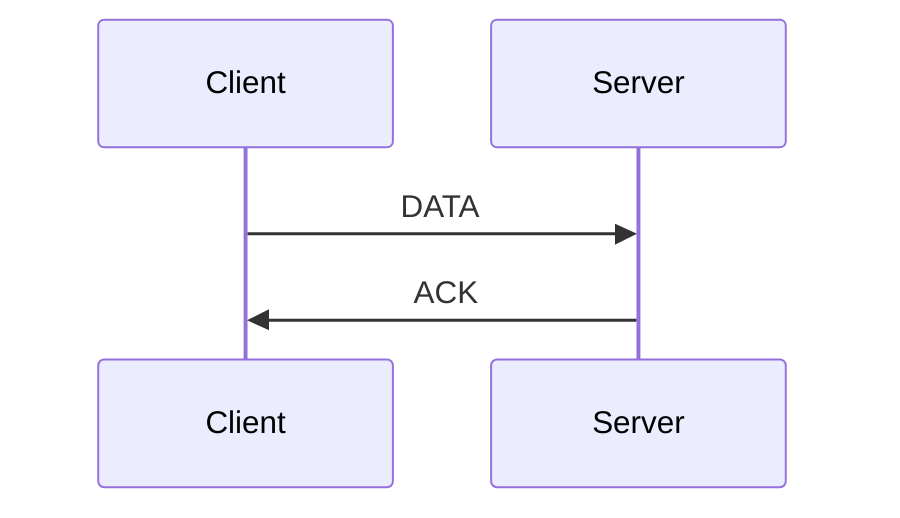

# Introduction to Networking

## BWSI AUVC 2023

<div class="absolute bottom-10">
  <span class="font-700">
    Dr. Mohamed Saad Ibn Seddik 👨‍✈️ - © 2023
  </span>
</div>

---

# What is Networking?

Networking is the practice of connecting two or more computing devices together for the purpose of sharing data.

Wifi, Bluetooth, Ethernet, and USB are all examples of networking technologies.
The Internet is a network of networks.



---

# Outline

- OSI
- DNS
- Ethernet
- MAC
- IP
- Ports
- Socket
- Packet

---

# OSI Model

The [OSI model](https://en.wikipedia.org/wiki/OSI_model) is a conceptual model that characterizes and standardizes the communication functions of a telecommunication or computing system without regard to its underlying internal structure and technology.



- Application Layer: HTTP, FTP, DNS, SMTP, SSH, ...
- Transport Layer: TCP, UDP, ...
- Network Layer: IP, ...
- Data Link Layer: Ethernet, ...
- Physical Layer: Copper, Fiber, ...

---

# DNS (Domain Name System)

The [Domain Name System](https://en.wikipedia.org/wiki/Domain_Name_System) (DNS) is a hierarchical and decentralized naming system for computers, services, or other resources connected to the Internet or a private network.

Each device connected to the Internet has a unique IP address which other machines use to find the device.
DNS servers eliminate the need for humans to memorize IP addresses such as `142.250.80.46` (IPv4) or `2607:f8b0:4004:80a::200e` (IPv6).

## mDNS (Multicast DNS)

[mDNS](https://en.wikipedia.org/wiki/Multicast_DNS) is a protocol that allows you to resolve hostnames to IP addresses on a local network without a DNS server.

This is useful for devices that do not have a DNS server configured, such as IoT devices.

```bash
$ ping backseat.local # backseat.local is a mDNS hostname
```

---
layout: image-right
image: https://upload.wikimedia.org/wikipedia/commons/e/e5/Network_switches.jpg
---

# Ethernet

[Ethernet](https://en.wikipedia.org/wiki/Ethernet) is a family of networking technologies for local area networks (LANs) and metropolitan area networks (MANs).

Ethernet is standardized as IEEE 802.3.

Today, Ethernet is the most widely used LAN technology.


---

# MAC Address

A [MAC address](https://en.wikipedia.org/wiki/MAC_address) is a unique identifier assigned to a network interface controller (NIC) for use as a network address in communications within a network segment.

MAC addresses are used as a network address for most IEEE 802 network technologies, including Ethernet and Wi-Fi.

---

# IP Address

An [IP address](https://en.wikipedia.org/wiki/IP_address) is a numerical label assigned to each device connected to a computer network that uses the Internet Protocol for communication.

An IP address serves two main functions: host or network interface identification and location addressing.

IP addresses follow the format `X.X.X.X` where `X` is a number between 0 and 255.

## DHCP (Dynamic Host Configuration Protocol)

Unlike MAC addresses, IP addresses are not permanent.
They can change depending on the network you are connected to.

When you connect to a network, your device is assigned an IP address by the network's [DHCP](https://en.wikipedia.org/wiki/Dynamic_Host_Configuration_Protocol) server.

If no DHCP server is available, your device will assign itself an IP address and try to use mDNS to find other devices on the network.

---

# Ports

A [port](https://en.wikipedia.org/wiki/Port_(computer_networking)) is a communication endpoint identified by a 16-bit number, commonly known as the port number.

Ports are used in combination with IP addresses to establish connections between devices.

Ports are used by the [Transport Layer](https://en.wikipedia.org/wiki/Transport_layer) to identify the application that should receive the data.

## Well-Known Ports

Ports are divided into three ranges:

- Well-Known Ports: 0-1023. Well-Known Ports are reserved for common applications such as HTTP (80), HTTPS (443), SSH (22), and FTP (21).
- Registered Ports: 1024-49151. Registered Ports are assigned by the Internet Assigned Numbers Authority (IANA) to a specific service or application.
- Dynamic Ports: 49152-65535. Dynamic Ports are used by the operating system to assign ports to applications.

---

# Socket

A [socket](https://en.wikipedia.org/wiki/Network_socket) is a software structure within a network node of a computer network that serves as an endpoint for sending and receiving data across the network.

## TCP Socket

A [TCP socket](https://en.wikipedia.org/wiki/Network_socket#TCP_socket) is a *connection-oriented* communication channel that allows two computers to communicate with each other.
It requires a connection to be established between the two computers before data can be sent.

## UDP Socket

A [UDP socket](https://en.wikipedia.org/wiki/Network_socket#UDP_socket) is a *connectionless* communication channel that allows two computers to communicate with each other.
It does not require a connection to be established between the two computers before data can be sent.


---

# TCP (Transmission Control Protocol)



---

# UDP (User Datagram Protocol)



---

# Packet

A [packet](https://en.wikipedia.org/wiki/Network_packet) is a formatted unit of data carried by a packet-switched network.

Packets are the fundamental unit of data transfer in computer networks.

## Packet Header

A packet header is a section of a packet that contains information about the packet.

The header is used by the network to route the packet to its destination.

## Packet Payload

The payload is the data that is being sent in the packet.


---
layout: quote
---

# Let's implement a simple chat application!
# 👩‍💻🧑‍💻👨‍💻

---
